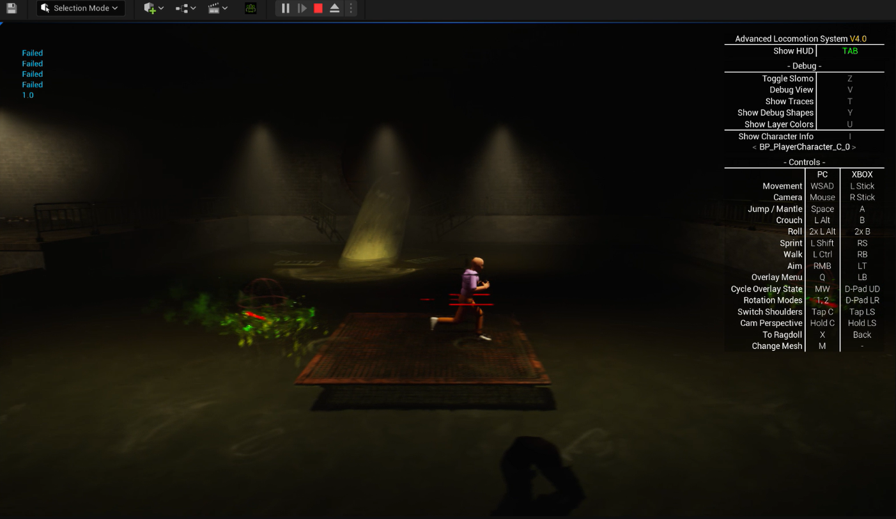
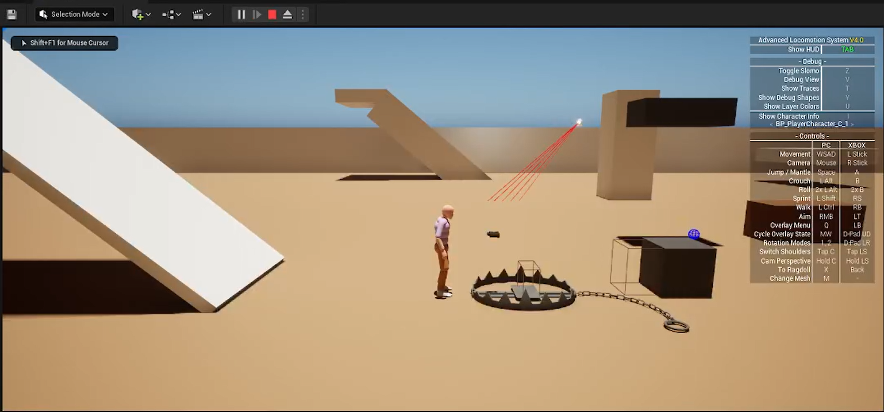
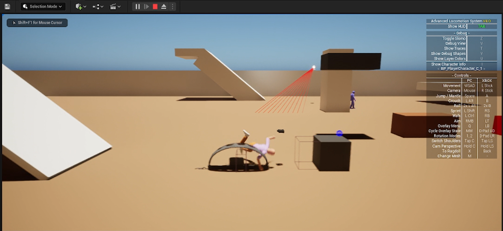

# unrealmechanic_rose
The AI-focused gameplay mechanics scene I developed for the game: Rose

🎬 [Download or watch demo video](https://github.com/eceozcan/unrealmechanic_rose/blob/main/Rose%20-%20Unreal%20Editor%202024-04-24%2017-32-39.rar)

# Swamp Monster

# Bear Trap

# website link
https://rosevideogame.com/ 

## Languages Used
- C++
- Blueprint

